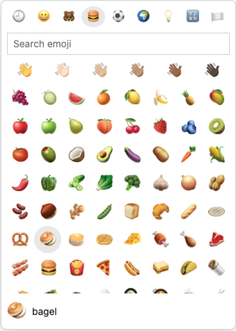

# emoji input
[](https://github.com/nichoth/emoji-input/actions/workflows/nodejs.yml)
[](README.md)
[](README.md)
[](https://semver.org/)
[](./CHANGELOG.md)
[](https://packagephobia.com/result?p=@nichoth/session-cookie)
[](https://bundlephobia.com/package/@substrate-system/emoji-input)
[](package.json)
[](LICENSE)

When someone types `:<text>`, open an emoji picker. Or trigger the emoji picker
programmatically.

* Wrap a `<textarea>`/`<input>`, or point at one with `for="id"`,
  or call `.attach(input)`.
* On input, it looks at the text by the caret for `:xx`
  (it is word-boundary aware, so `http://foo` doesn't trigger).
  Two chars minimum.
* The list is a `<div popover="manual">`
* Position comes from a mirror-div caret measurement, flipped above the caret
  if there's no room below.
* Up and down arrows cycle, Enter/Tab insert emoji + space via setRangeText,
  Esc closes.
* Mouse hover/click also work; pointerdown is prevented so the field keeps focus.
* Fires emoji-select ({ emoji, query }) and a synthetic input event so
  frameworks pick up the change.
* no shadow DOM

[See a live demo](https://nichoth.github.io/package-name/)

<details><summary><h2>Contents</h2></summary>

<!-- toc -->

- [Install](#install)
- [Example](#example)
  * [JS](#js)
- [Modules](#modules)
  * [ESM](#esm)
  * [Common JS](#common-js)
- [CSS](#css)
  * [Import CSS](#import-css)
  * [Customize CSS via some variables](#customize-css-via-some-variables)
  * [pre-built JS](#pre-built-js)

<!-- tocstop -->

</details>

## Install

```sh
npm i -S @substrate-system/emoji-input
```

## Example

Use this with a `textarea` or `input` as a child, or give it a `for` attribute
equal to the `id` attribute of a `textarea` or `input`.

```js
import { EmojiInput } from '@substrate-system/emoji-input'

document.body += `
    <div class="example">
        <${EmojiInput.TAG}>
            <textarea></textarea>
        </${EmojiInput.TAG}>
    </div>
`
```

### Emoji Picker Component

An emoji picker UI. This package inlcudes a convenient button
component for openening the picker.

```ts
import { EmojiPicker } from '@substrate-system/emoji-input/picker'
import { EmojiButton } from '@substrate-system/emoji-input/button'

// note `id` attributes
document.body.innerHTML += `
  <textarea id="message"></textarea>

  <${EmojiButton.TAG} for="picker"><//>
  <${EmojiPicker.TAG} id="picker" for="message"><//>
`
```




## Modules

This exposes ESM and common JS via
[package.json `exports` field](https://nodejs.org/api/packages.html#exports).

### ESM

```js
import { EmojiInput } from '@substrate-system/emoji-input'
```

### Common JS

```js
require('@substrate-system/emoji-input')
```

## CSS

### Import CSS

```js
import '@substrate-system/emoji-input/css'
```

Or minified:

```js
import '@substrate-system/emoji-input/css/min'
```

### pre-built JS

This package exposes minified JS files too. Copy them to a location that is
accessible to your web server, then link to them in HTML.

#### copy

```sh
cp ./node_modules/@substrate-system/emoji-input/dist/index.min.js ./public/emoji.min.js
```

#### HTML

```html
<script type="module" src="./emoji.min.js"></script>
```
